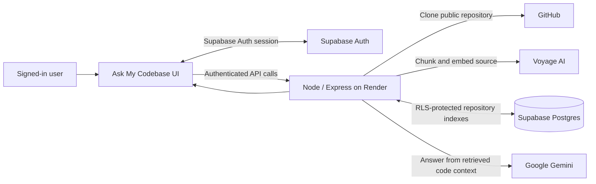

# Ask My Codebase

Chat privately with a codebase. Each person creates an account, indexes repositories,
and can only list, poll, or ask questions about their own indexed data.

**Live app:** [ask-my-codebase.onrender.com](https://ask-my-codebase.onrender.com/)

## Architecture



Supports Java, JavaScript/TypeScript, and Python out of the box (easy to extend —
see `SYMBOL_PATTERNS` in `src/chunker.js`).

## Run locally

1. **Get API keys and auth settings**
   - Gemini: create an API key in https://aistudio.google.com/app/apikey (for answering questions)
   - Voyage AI: https://dash.voyageai.com (for embeddings — has a free tier, and
     provides the semantic-search vectors)
   - Supabase: create a project at https://supabase.com/dashboard. In **Project
     Settings → API**, copy the Project URL and publishable (or legacy `anon`) key.
     In **Authentication → URL Configuration**, add `http://localhost:3000` as a
     Redirect URL while developing.

2. **Install and configure**
   ```bash
   npm install
   cp .env.example .env
   # edit .env and add all four credentials
   ```

3. **Run locally**
   ```bash
   npm start
   # open http://localhost:3000
   ```

4. Open http://localhost:3000, create an account (and confirm the email if enabled),
   then sign in. Paste a public GitHub repo URL (e.g. `https://github.com/spring-projects/spring-petclinic.git`),
   click **Index repo**, wait for it to finish, then start asking questions like
   *"what does X do"* or *"where is Y used"*.

## Deploy with Render

This repository contains a `Dockerfile` and a free-tier `render.yaml`. Repository
indexes are stored in Supabase Postgres, not on Render's filesystem, so they survive
Render restarts and free-service spin-downs. Row Level Security keeps each user's
rows private to their authenticated Supabase account.

1. Push this project to a GitHub repository. Do not commit `.env`.
2. In Supabase, open **SQL Editor → New query**, paste and run
   [`supabase/schema.sql`](supabase/schema.sql). This creates the repository table
   and its per-user Row Level Security policies. Then open **Authentication → URL Configuration** and set the Site URL
   to your eventual Render URL (for example `https://ask-my-codebase.onrender.com`).
   Add that same URL to Redirect URLs. Configure your preferred email confirmation
   behavior under **Authentication → Providers → Email**.
3. At https://dashboard.render.com, choose **New → Blueprint**, connect the GitHub
   repository, and select its `render.yaml`.
4. Enter the four secret environment variables when Render asks for them:
   `GEMINI_API_KEY`, `VOYAGE_API_KEY`, `SUPABASE_URL`, and
   `SUPABASE_ANON_KEY`. Use the Supabase **anon/publishable** key, never the
   `service_role` key.
5. Create the service. It runs on Render's Free plan and needs no persistent disk.
   Open the generated URL, create an account, and test an index-and-chat flow.

Render's Free service can take around a minute to wake after 15 minutes of
inactivity. This does not delete indexes, because they live in Supabase. The
Supabase Free plan is suitable for a hobby deployment, but its projects pause after
extended inactivity and it has a 500 MB database limit.

## Privacy and security model

- The browser signs users in through Supabase Auth. The backend verifies the
  Supabase access token on every API request.
- Each repository record is tagged with the authenticated user's immutable
  Supabase user ID. API routes filter and authorize against that ID, so one user
  cannot access another user's repository list, ingest job, or chat context.
- The Supabase anon key is safe to expose to the browser. Keep Gemini, Voyage,
  and any Supabase `service_role` key private in deployment secrets.
- Gemini's free tier may use submitted content to improve Google's products. Do
  not use that tier for source code you are not comfortable sending to Google.
- This version accepts public HTTPS GitHub repository URLs only; it does not
  accept or retain GitHub credentials for private Git repositories.

## Known limitations

- **Chunking is regex/heuristic-based**, not a real AST parser (no tree-sitter
  dependency, which keeps deployment simple but means very unusual formatting
  can occasionally mis-detect a method boundary).
- **Vector search is in-memory cosine similarity** after loading a repository's
  chunks from Supabase — fine for small-to-medium repos, but not for huge monorepos.
- Indexing and embedding costs are shared by the deployment owner's API keys.
  For a public launch, add rate limiting and usage quotas before inviting many users.
- Repository data is stored as JSONB in Supabase Postgres. It is practical for small
  codebases and hobby use; use a dedicated vector database for very large repositories.

## Project structure

```
server.js              Express app, API routes
src/chunker.js          Splits files into function/class-level chunks
src/embeddings.js       Voyage AI embedding calls
src/vectorstore.js      Supabase storage + cosine similarity search
src/ingest.js           Orchestrates clone → chunk → embed → save
src/chat.js             RAG: retrieve chunks → ask Gemini → return cited answer
public/index.html       Chat UI
```

---

Created by **Navneet Kumar**
